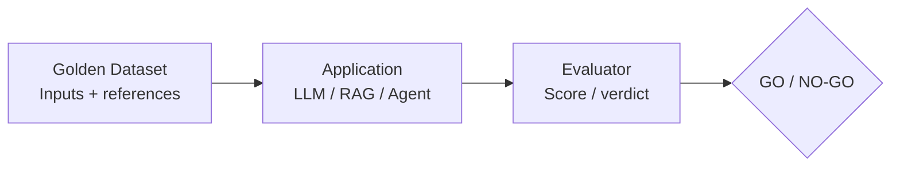
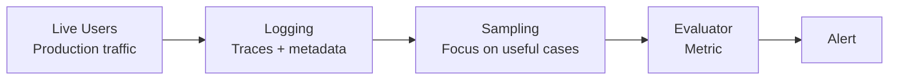
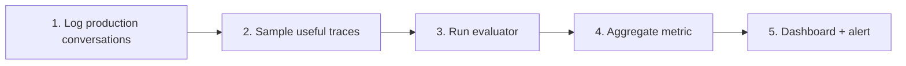
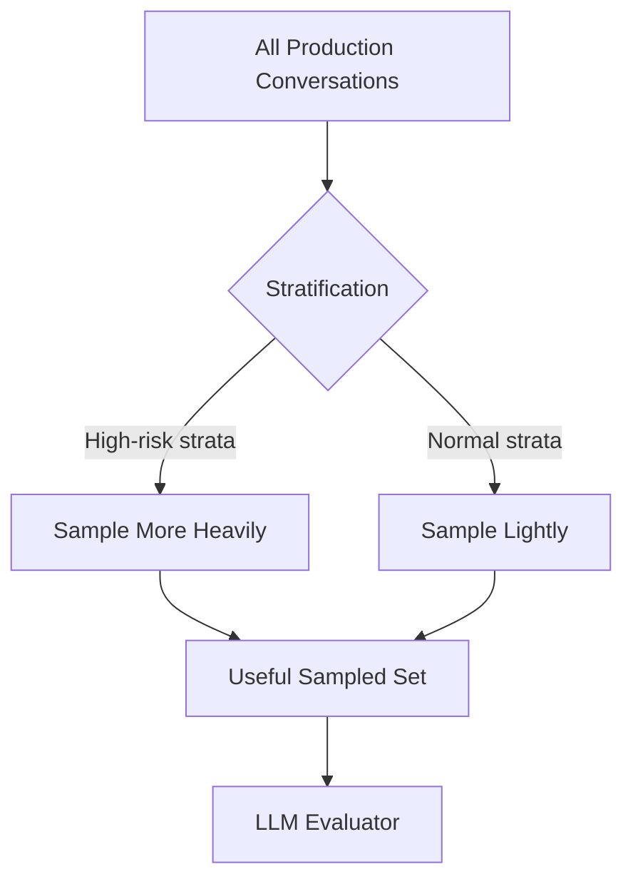
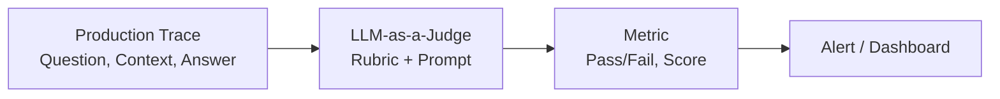

---
> [YouTubeVideo](https://www.youtube.com/watch?v=SahaDGzN-Bk&list=PLEneLIDJFpcA&index=8)

> [HTML Notes](https://sudhir-garg.github.io/notes/LLMEvaluation/html/OfflineVsOnlineEvaluation.html)
---

## Table of Contents
1. [Course recap](#1-course-recap-where-this-session-fits)
2. [Offline evaluation](#2-what-is-offline-evaluation)
3. [Three benefits](#3-three-major-benefits-of-offline-evals)
4. [Production risks](#4-why-offline-evals-are-not-enough-in-production)
5. [Online evaluation](#5-what-is-online-evaluation)
6. [Offline vs online](#6-offline-evaluation-vs-online-evaluation)
7. [Correctness vs normality](#7-correctness-vs-system-normality)
8. [Production signals](#8-what-can-be-monitored-online)
9. [Online pipeline](#9-the-online-evaluation-pipeline)
10. [Step 1 — logging](#10-logging-the-foundation-of-online-evaluation)
11. [Step 2 — sampling](#11-sampling-control-evaluation-cost)
12. [Computed quantities](#12-captured-vs-computed-quantities)
13. [LLM as a judge](#13-llm-as-a-judge-for-production-traces)
14. [Evaluator types](#14-multiple-online-evaluators)
15. [LangSmith role](#15-langsmith-in-the-lectures-workflow)
16. [Self-improving loop](#16-the-self-improving-evaluation-loop)
17. [Implementation sketches](#17-putting-the-concepts-together)
18. [Key takeaways](#18-key-takeaways)
---

## 1. Course Recap: Where This Session Fits

The lecture positions offline and online evaluation as two complementary layers of an LLM application's evaluation strategy.


* **Why Evals?** Understand why an LLM application must be evaluated rather than simply deployed.
* **What Are Evals?** The course has covered model-based and application-based evaluation.
* **Evaluation Pipeline:** Evaluation is treated as a repeatable pipeline rather than a one-off manual test.
* **Multiple Pipelines:** A single application can fail at component, workflow, and application levels.
* **Risk Categories:** Quality, safety, and operations require different evaluation perspectives.
* **Evaluation Methods:** Programmatic evaluation, LLM-as-a-judge, and human evaluation were introduced.

> **Central idea:** One evaluation pipeline is rarely enough. Different failure points and risk categories require different evaluation pipelines.

---

## 2. What Is Offline Evaluation?

Offline evaluation means evaluating an LLM-based application **before it is deployed**. The lecture treats the evaluation pipelines discussed in the previous sessions—including the UPSC grader example—as examples of offline evaluation.



The goal is straightforward: determine whether the application is good enough to release into production.

---

## 3. Three Major Benefits of Offline Evals

### 3.1 Pre-release testing and release gating
Without testing, production behavior is uncertain. Offline evaluation gives a controlled test before release.

The lecture connects this to automated CI/CD gating: an evaluation score can be compared with a threshold. If the score passes the threshold, deployment can proceed; if not, deployment can be blocked or a previous version retained.

```python
# Illustrative release-gate logic
eval_score = run_offline_evaluation(version="candidate")

THRESHOLD = 0.95

if eval_score >= THRESHOLD:
    deploy()
else:
    block_deployment()
    notify_team("Evaluation threshold failed")
```

> **Tip — Think of offline eval as a release gate:** "Is this version good enough to ship?"

---

### 3.2 Version comparison
Offline evals provide a controlled way to compare alternatives because the same evaluation setup can be run against multiple versions.


The key principle is controlled comparison: if the evaluation setup is held constant, the resulting scores become useful evidence for choosing between versions.

---

### 3.3 Regression testing
**Regression testing** asks whether a change that improves one part of the system accidentally damages another part.

For example, a chatbot may be changed to sound more polite. The new prompt could improve tone while unintentionally making factual responses less precise. The new version may therefore improve one metric and regress another.


A golden dataset should cover multiple classes of real questions—for example pricing, refunds, curriculum, and other important categories. Compare category-level scores before and after a change.

```python
# Illustrative regression check
baseline = evaluate(version="production")
candidate = evaluate(version="candidate")

for category in baseline:
    change = candidate[category] - baseline[category]
    print(category, change)

# Investigate categories with unacceptable degradation.
```

---

## 4. Why Offline Evals Are Not Enough in Production

Passing offline evaluation does not eliminate production risk. Once an application is live, it encounters a much larger and less predictable input space.


### Data drift and obsolete golden datasets
Suppose a RAG chatbot is evaluated against documents that describe today's prices and policies. A year later, those documents may have changed substantially. If the golden dataset is not updated, the offline score may remain high while real users experience poor behavior.


---

## 5. What Is Online Evaluation?

**Online evaluation** evaluates an application on **live production traffic after deployment**.

The most important distinction in the lecture is that online evaluation generally operates **without a fixed golden dataset / answer key for every new production interaction**. The system must therefore use production traces and alternative signals to determine whether behavior remains healthy.



> **Note — One-sentence distinction:** Offline eval asks, *"Does this application work correctly on controlled test cases?"* Online eval asks, *"Is the deployed application behaving normally in the real world?"*

---

## 6. Offline Evaluation vs Online Evaluation


> **Tip — Remember:** Online evaluation is not a replacement for offline evaluation. The two layers answer different questions.

---

## 7. Correctness vs System Normality


### The UPSC grader example
In the lecture's example, the system grades UPSC answers. Offline, the system's score can be compared with a human's score. That gives a direct correctness signal.

After deployment, a newly submitted answer may not have a human score. Therefore, the system cannot directly say, *"my score is correct"* for that particular unseen example.

Instead, production behavior can be compared with a baseline distribution. If score distributions that were previously stable suddenly shift, the change becomes a trigger for investigation.


This does not prove that the current system is wrong. It tells you that something changed and deserves investigation.

---

## 8. What Can Be Monitored Online?

### 8.1 User feedback signals
A simple example is thumbs-up / thumbs-down feedback. A sudden increase in negative feedback can indicate a degradation even when a formal answer key is unavailable.

### 8.2 Conversation behavior
* Users repeatedly ask or rephrase the same question.
* Conversations terminate abruptly.
* Users escalate from the bot to a human.
* Users request an email or human contact.
* Important flows such as pricing, refunds, admissions, or fees show unusual behavior.

### 8.3 Captured operational quantities
Some metrics do not require an evaluator at all because they are directly captured during execution.


### 8.4 Computed evaluation quantities
Other metrics require an evaluator to compute them from traces, such as hallucination rate, toxicity, safety violations, or other qualitative properties.

---

## 9. The Online Evaluation Pipeline

The lecture builds the online pipeline progressively:



> **Note:** Two branches exist after logging: captured quantities such as latency can go directly to monitoring; computed quantities such as hallucination require an evaluator.

---

## 10. Step 1 — Logging: The Foundation of Online Evaluation

If production interactions are not recorded, they cannot be evaluated later. Logging therefore comes first.

### What should a production trace contain?


### Privacy and PII masking
The lecture emphasizes that personal identifiable information should be removed, blurred, or masked before traces are stored in a system such as LangSmith.


```python
# Illustrative PII masking sketch
import re

def mask_pii(text: str) -> str:
    text = re.sub(r'\b\d{10}\b', '[PHONE]', text)
    text = re.sub(r'\b\d{12}\b', '[ID]', text)
    return text

safe_text = mask_pii(user_message)
store_trace(safe_text)
```
*Note: The code above is an implementation sketch. Production PII detection should use a robust, context-aware approach rather than relying only on simple regular expressions.*

---

## 11. Step 2 — Sampling: Control Evaluation Cost

Running an expensive evaluator—especially an LLM-as-a-judge—on every production trace can be costly. Sampling reduces this cost.

### Why random sampling alone may be weak
Not all conversations are equally informative. A random sample may contain many routine, successful interactions and too few high-risk cases.

### Stratified sampling
The lecture recommends **stratified sampling**: first divide conversations into meaningful categories, then deliberately sample more heavily from categories that are more likely to expose problems.




```python
# Illustrative stratified sampling
from random import sample

def stratified_sample(traces, n_per_stratum):
    strata = {
        "negative_feedback": [],
        "escalation": [],
        "high_impact": [],
        "normal": []
    }

    for trace in traces:
        strata[classify_trace(trace)].append(trace)

    selected = []
    for name, items in strata.items():
        k = min(len(items), n_per_stratum.get(name, 0))
        selected.extend(sample(items, k))

    return selected
```

---

## 12. Captured vs Computed Quantities

### Path A — Captured quantities
Latency, error rate, call count, and cost can be recorded directly during execution. The lecture summarizes the flow as:

$$\text{Log} \longrightarrow \text{Dashboard} \longrightarrow \text{Threshold} \longrightarrow \text{Alert} \longrightarrow \text{Action}$$

A dashboard is more useful when metrics are aggregated over a time window rather than interpreted from a single conversation in isolation.

### Path B — Computed quantities
For a metric such as hallucination rate, the raw trace does not directly contain the metric. An evaluator must inspect the trace and compute it.

$$\text{Log Traces} \longrightarrow \text{Sample} \longrightarrow \text{Evaluator} \longrightarrow \text{Metric} \longrightarrow \text{Dashboard + Alert}$$

---

## 13. LLM-as-a-Judge for Production Traces

For a reference-free production metric such as hallucination detection, the lecture proposes using another LLM as an evaluator.

### What does the judge receive?
* The retrieved context, when evaluating a RAG application.
* The user's question.
* The application's generated answer.
* A detailed rubric explaining what counts as a hallucination.




```python
# Illustrative judge prompt
judge_prompt = """
You are evaluating a RAG chatbot for hallucination.

Question:
{question}

Retrieved context:
{context}

Chatbot answer:
{answer}

Rubric:
- Mark hallucination=true if the answer contains claims unsupported
  by the supplied context.
- Mark hallucination=false if the answer is fully supported.
- Return a score and a short reason.
"""
```

---

## 14. Multiple Online Evaluators

The lecture emphasizes that online evaluation is not one single metric. Multiple evaluators can monitor different risk dimensions.


The important architectural lesson is: **different risks need different evaluation pipelines.**

---

## 15. LangSmith in the Lecture's Workflow

The lecture uses LangSmith as a concrete example of an evaluation platform that can support both offline and online workflows.

### Tracing vs datasets

| Evaluator target | What it means |
| :--- | :--- |
| **Production traces** | The evaluator runs against logged live interactions $\rightarrow$ **online evaluation**. |
| **Dataset** | The evaluator runs against curated examples $\rightarrow$ **offline evaluation**. |

The evaluator configuration can include:
* The application to evaluate.
* The LLM used as the judge.
* Model settings such as temperature.
* A rubric / evaluator prompt.
* The expected output format.
* Whether evaluation runs over traces or a dataset.

> **Useful mental model:** The same evaluator logic can participate in both modes; the major difference is the evaluation target—live traces versus a curated dataset.

---

## 16. The Self-Improving Evaluation Loop

The lecture closes with the most important operational idea: production failures should not disappear after they are observed. They should improve the offline evaluation dataset.

```
       ┌───────────────────────────┐
  ┌───>│    Offline Evaluation     │
  │    │ (Curated/updated dataset) │
  │    └─────────────┬─────────────┘
  │                  │
  │                  ▼
  │    ┌───────────────────────────┐
  │    │     Deploy Candidate      │
  │    └─────────────┬─────────────┘
  │                  │
  │                  ▼
  │    ┌───────────────────────────┐
  │    │   Production Monitoring   │
  │    │  (Live traces + evals)    │
  │    └─────────────┬─────────────┘
  │                  │
  │                  ▼
  │    ┌───────────────────────────┐
  │    │   Failures / Anomalies    │
  │    └─────────────┬─────────────┘
  │                  │
  │                  ▼
  │    ┌───────────────────────────┐
  └────┤ Annotate & Add to Dataset │
       └───────────────────────────┘
```

### The loop step by step
1. Create / update the golden dataset.
2. Run offline evaluation.
3. Deploy a passing version.
4. Monitor live production traffic.
5. Identify failures and anomalous conversations.
6. Annotate important traces and add them to the offline dataset.
7. Run offline evaluation again, then repeat the cycle.


---

## 17. Putting the Concepts Together

### 17.1 A minimal trace structure
```python
trace = {
    "conversation_id": "conv_123",
    "turn_id": "turn_07",
    "user_id": "user_456",
    "timestamp": "2026-10-04T10:30:00Z",
    "question": "...",
    "retrieved_context": ["...", "..."],
    "answer": "...",
    "latency_ms": 820,
    "prompt_tokens": 850,
    "completion_tokens": 190,
    "cost": 0.0042,
    "thumbs_up": False,
    "escalated": True
}
```

### 17.2 Monitoring a captured metric
```python
LATENCY_THRESHOLD_MS = 4000

latency = trace["latency_ms"]
record_metric("latency_ms", latency)

if latency > LATENCY_THRESHOLD_MS:
    send_alert(
        metric="latency_ms",
        value=latency,
        threshold=LATENCY_THRESHOLD_MS
    )
```

### 17.3 A conceptual online evaluation pipeline
```python
def online_eval_pipeline(traces):
    # 1. Keep production traces
    logged = [mask_sensitive_data(t) for t in traces]

    # 2. Stratified sampling
    sampled = stratified_sample(logged, {
        "negative_feedback": 100,
        "escalation": 100,
        "high_impact": 100,
        "normal": 50,
    })

    # 3. Evaluate sampled traces
    results = [judge(trace) for trace in sampled]

    # 4. Aggregate
    metric = aggregate(results)

    # 5. Monitor
    dashboard.write(metric)

    # 6. Alert
    if metric["hallucination_rate"] > 0.05:
        send_alert("Hallucination rate exceeded threshold")

    return metric
```

### 17.4 Closing the loop
```python
production_failures = identify_problematic_traces()

for trace in production_failures:
    annotation = human_review(trace)
    if annotation.is_useful:
        offline_dataset.add(trace, annotation)

# The next offline run now contains newly discovered failure modes.
run_offline_evaluation(offline_dataset)
```

---

## 18. Key Takeaways


### Interview-ready definitions


---

> **Final Mental Model:**  
> Build $\rightarrow$ Offline Evaluate $\rightarrow$ Gate $\rightarrow$ Deploy $\rightarrow$ Log $\rightarrow$ Sample $\rightarrow$ Evaluate $\rightarrow$ Dashboard $\rightarrow$ Alert $\rightarrow$ Investigate $\rightarrow$ Add failures to dataset $\rightarrow$ Offline Evaluate again.
